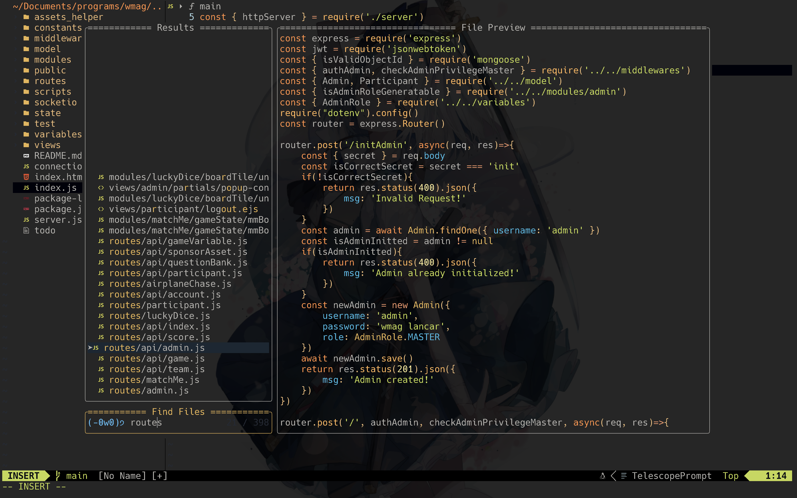

#  NVIM Config
This is my simple nvim 0.8.0 config for my daily working.

<p align="center">
    
    
    
    
</p>

<sub>_Notes: for the background you must set your own background in your terminal emulator._</sub>

## 🌟 Overview
### Main
- Config for newest [neovim](https://neovim.io) 0.8.0
- Use [**Packer**](https://github.com/wbthomason/packer.nvim) as nvim plugin manager

### Plugins & Features
- **Easy File Navigation** with [**Telescope**](https://github.com/nvim-telescope/telescope.nvim) & [**Harpoon**](https://github.com/ThePrimeagen/harpoon). 
    - Find file like `ctrl` + `p` in vsc*de
    - See all commits and file changes in your git repo
    - Search manual, help, documentation.
    - Bookmark file and navigate easily with just few keystroke
- **LSP Integrated**. Makes neovim IDE-ish
    - Show Diagnostic such as Warning, Hint, Error of your codebase.
    - Code Action 💡
    - Go to Variable Definition & Implementation. (with help of [lspsaga](glepnir/lspsaga.nvim))
    - Format Whole Document.
    - See document outline and navigate to each property.
    - AutoComplete. (using [cmp](https://github.com/hrsh7th/nvim-cmp))
    - Snippet. (using [ultisnips](https://github.com/SirVer/ultisnips))
- **Better source code highlighting and context navigation** with [Treesitter](https://github.com/nvim-treesitter/nvim-treesitter).
- **Project Structure** with [nvim-tree](https://github.com/kyazdani42/nvim-tree.lua). see project structure and interact with your file.
- **Customized Start Screen** with [startify](https://github.com/mhinz/vim-startify), show your recently edited files and bookmarked files. you can also go to that file.
- **Discord Rich Presence** with [presence](https://github.com/andweeb/presence.nvim) , show what you working now and time ellapse in your discord.

### Other Plugins
- [neovim-ayu](https://github.com/Shatur/neovim-ayu), colorscheme. AYU FTW
- [lspkind](https://github.com/onsails/lspkind.nvim), better cmp UI
- [lualine](https://github.com/nvim-lualine/lualine.nvim), better statusline UI instead of native nvim statusline
- [nvim-web-devicons](https://github.com/kyazdani42/nvim-web-devicons), icon


## 🔧 Requirement
Here's few importants requirements to use this config perfectly.

### OS Requirement
- MacOS or ANY Linux Distros
> For Windows User, I **HIGHLY RECOMMEND** to use [WSL](https://learn.microsoft.com/en-us/windows/wsl/install).  

<sub>*Just migrate to Mac or Linux will ya :)*</sub>

### Software Requirement
- **Neovim** <sub>(duh)</sub>. Get it on your favorite OS package manager such as brew (for MacOS), dnf, apt.
```sh
# for brew
$ brew install neovim

# to check wether proper neovim is properly installed
$ nvim --version
```
- **pynvim**. This is used by **ultisnips** engine for snippet.
```sh
$ python3 -m pip install --user --upgrade pynvim
```
- **ripgrep**. This is used by **telescope** for `live_grep` features. You can install ripgrep in your OS Package Manager.
```sh
# for brew
$ brew install ripgrep
```

### LSP Requirement 
LSP is used to make your text editor smarter and have context of your codebase, or to make your text-editor become IDE. Since LSP for each programming language is different you can install your favorite programming languages LSP.
- **TSServer**. LSP for Javascript & Typescript. You'll need [npm](https://www.npmjs.com)
    ```bash
    # Install LSP
    $ sudo npm i -g typescript typescript-language-server

    # Check Path & Installation
    $ typescript-language-server --version
    ```
- **GOPLS**. LSP for Go. You'll need to install [go](https://go.dev).  
    Make sure `go/bin` is accessible in `$PATH`
    ```sh
    # ~/.zshrc
    export PATH="$PATH:$HOME/go/bin"
    ```          
    Install LSP
    ```bash
    # Install LSP
    $ go install golang.org/x/tools/gopls@latest

    # Check Path & Installation
    $ gopls version
    ```
- **SourceKit**. LSP for Swift. For this LSP there are few ways to install it. For me the easiest way is to just install [xcode](https://developer.apple.com/xcode/), because xcode come with LSP. but you can see other installation method on [their official repo](https://github.com/apple/sourcekit-lsp). And after that make sure `sourcekit-lsp` is accessible in `$PATH`
    ```sh
    # ~/.zshrc
    export PATH="$PATH:/Applications/Xcode.app/Contents/Developer/Toolchains/XcodeDefault.xctoolchain/usr/bin/sourcekit-lsp"
    ```
_Notes: if installation succeed but you can't run that LSP, make sure that your LSP is accessible in `$PATH`_

### UI Requirement
This config use [nerdfont](https://www.nerdfonts.com/font-downloads), so you'll need to set your terminal emulator font using nerdfont and enable ligature options.


## 🏃‍♂️ Getting Started
After you met all the requirement and done setup. Follow this step to use my nvim config
1. Clone / download this project anywhere
```sh
$ git clone https://github.com/davindj/nvim-config
```
2. Move config to nvim configuration folder `~/.config/nvim`
```sh
# make sure you backup your nvimconfig, otherwise it will be overwritten
$ mv ./nvim-config ~/.config/nvim
```
3. Run neovim
```sh
$ nvim
```
4. On the neovim, run this command to make sure all plugins were installed properly.
```
:PackerSync
```
5. Done!. Enjoy my config 😜.


## 🎯 TODO Next
- Try out other colorscheme
- Mess around with Telescope
- Config Treesitter, especially context headline
- Config Ultisnips and create customized snippet
- LSP_SIGNATURE for better help when code writing
- Explore linter plugin(?)
- Explore Debugging Plugin
- Explore GIT-related Plugin
- Config markdown plugin. seriously rn I use vsc*de for create this `readme.md`
- Add keymap list in this readme


## 📒 Additional Notes
If you have some tips 👍, ideas 💡, recommendations 📝, or even BUGG 👾, feel free to contact me :). And if you find this config useful, don't forget to give a 🌟
